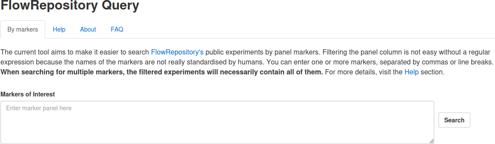

<!-- README.md is generated from README.Rmd. Please edit that file -->

```{r, include = FALSE}
knitr::opts_chunk$set(
  collapse = TRUE,
  comment = "#>",
  fig.path = "man/figures/README-",
  out.width = "100%"
)
```

# FlowRepositoryQuery 

<!-- badges: start -->

[](https://lifecycle.r-lib.org/articles/stages.html#stable)

<!-- badges: end -->

{FlowRepositoryQuery} is an R package providing comprehensive data on all public experiments from the FlowRepository database, updated as of August 1, 2024. It also includes a dedicated Shiny application for filtering experiments based on their marker panels, making it easier to explore relevant datasets.


### Access the Application via Shiny Server

You can directly use the web tool through the following Shiny Server link:

- [FlowRepositoryQuery on ShinyApps.io](https://i-cyto.shinyapps.io/FlowRepositoryQuery/)


### Installation Guide

To install the latest version of the `{FlowRepositoryQuery}` package from GitHub, use the following command:

```{r , eval=FALSE}
remotes::install_github("i-cyto/FlowRepositoryQuery")
```


### Launch the Application

Once installed, you can start the Shiny application by running:

```{r , eval=FALSE}
FlowRepositoryQuery::run_app()
```
<br/>

<center>



</center>

````{=html}
```{r, echo=FALSE, results='asis'}
xfun::file_string("inst/app/www/about.html")
```

```{r, echo=FALSE, results='asis'}
xfun::file_string("inst/app/www/context.html")
```


````
<br/>

### About

You are reading the doc about version : `r golem::pkg_version()`

This README has been compiled on the

```{r}
Sys.time()
```

Here are the tests results and package coverage:

```{r, error = TRUE}
devtools::check(quiet = TRUE)
```

```{r echo = FALSE}
unloadNamespace("FlowRepositoryQuery")
```
