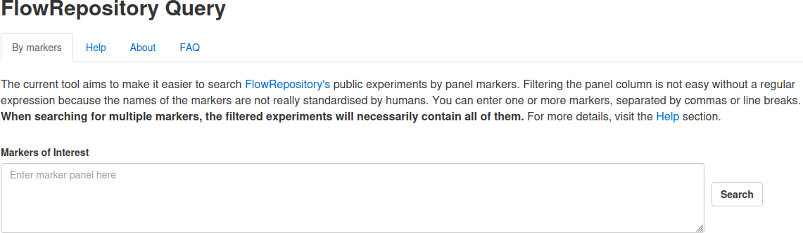
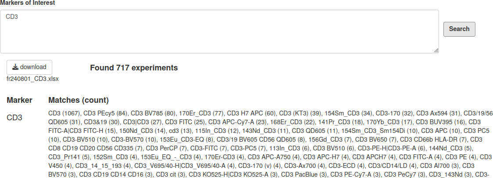
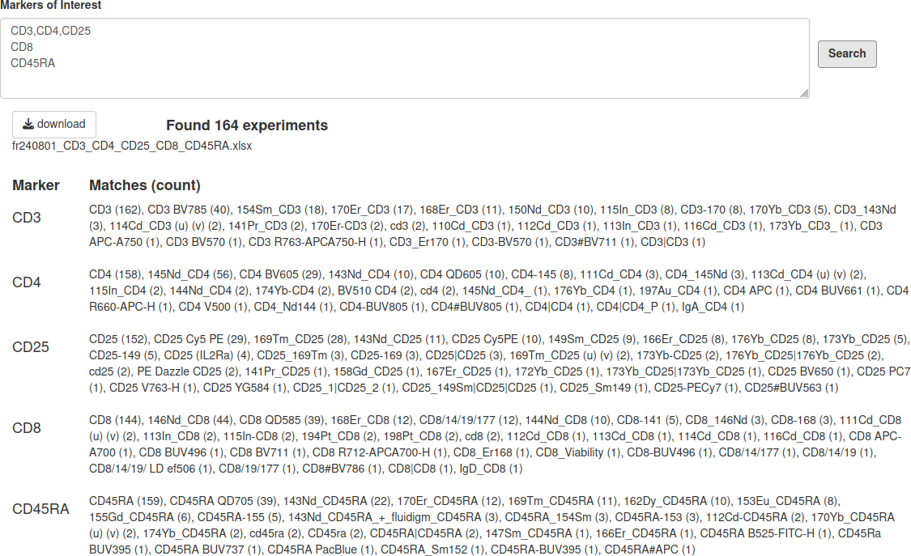
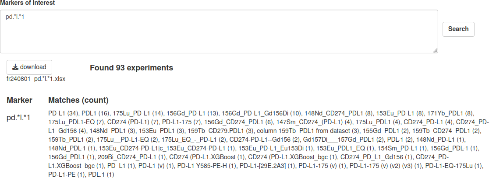

<!-- README.md is generated from README.Rmd. Please edit that file -->

# FlowRepositoryQuery 

<!-- badges: start -->

[](https://lifecycle.r-lib.org/articles/stages.html#stable)

<!-- badges: end -->

{FlowRepositoryQuery} is an R package providing comprehensive data on
all public experiments from the FlowRepository database, updated as of
August 1, 2024. It also includes a dedicated Shiny application for
filtering experiments based on their marker panels, making it easier to
explore relevant datasets.

### Access the Application via Shiny Server

You can directly use the web tool through the following Shiny Server
link:

- [FlowRepositoryQuery on
  ShinyApps.io](https://i-cyto.shinyapps.io/FlowRepositoryQuery/)

### Installation Guide

To install the latest version of the `{FlowRepositoryQuery}` package
from GitHub, use the following command:

``` r
remotes::install_github("i-cyto/FlowRepositoryQuery")
```

### Launch the Application

Once installed, you can start the Shiny application by running:

``` r
FlowRepositoryQuery::run_app()
```

<br/>

<center>

<figure>

<figcaption aria-hidden="true">Application appearance on
opening</figcaption>
</figure>

</center>

<h3 class="western" style="line-height: 200%">How
To</h3>
<p style="line-height: 115%"><font size="3" style="font-size: 12pt">The
current tool aims to make it easier to search FlowRepository's public
experiments by panel markers. Filtering the panel column is not easy
without a regular expression because the names of the markers are not
really standardised by humans.</font></p>
<p style="line-height: 115%"><font size="3" style="font-size: 12pt">CD3 is not CD33, even though CD33 contains CD3. You therefore need to search for words rather than strings of characters, as shown in the illustration below.<br/><br/>    
  <div class="image-container">
        
        <figcaption>Top match examples with CD3</figcaption>
  </div>
<br/>    
    You can enter several markers at once, and they will all be present in
the resulting selection of experiments. </font>
<br/><br/>    
&#10;    <div class="image-container"><figure>
        
        <figcaption>Results on a search for several markers</figcaption></figure>
&#10;  </div>
&#10;
<br/>
PD-L1 has many spellings, as does PD1. Therefore, the search must include
wildcards to match separators such as '-', '_' or even '.'. This is
the role of '.', which symbolises the wildcard character. 
&#10;For example, the query 'PD.L1' will find 'PD-L1', 'PD_L1', but also
'PDXL1'. The latter is not relevant but could be easily removed. The
most important thing is probably not to miss any writing. If the
possible characters are known, they can be listed, for example
'PD[-_.]L1' for 'PD-L1', 'PD_L1' or 'PD.L1'. 
&#10;Postfixing a character or a sequence with '*' indicates that it may or may not be present.
For example 'PD[-_.]*L1' will also match 'PDL1'. You probably know
enough to enjoy regular expressions for finding markers.<br/><br/>    
&#10;    <div class="image-container">
        
        <figcaption>Examples of PD-L1 matching</figcaption>
    </div>
<br/>
&#10;
<h3 class="western" style="line-height: 200%">
Context</h3>
<p style="line-height: 115%"><font size="3" style="font-size: 12pt"><a href="http://flowrepository.org/">FlowRepository</a>
is an important resource for the community. It contains a large
number of public experiments that could be useful for improving
analytical pipelines, as external experiments to validate results or
as a source of hypotheses.<br/>
<br/>
To improve analytical
pipelines, I'd like to identify experiments and add tags to announce
when an experiment could be a standard for developing or validating
one of the steps in the pipeline. Unfortunately, it's very difficult?
to browse and filter the information presented on the FR public page.
I have therefore analysed the FR public pages, collected information
and compiled it into a table. This table is available in the form of
a Google sheet, which could make it easier to access the information.
There is a ‘dictionary’ tab to explain the columns reported and
their origin.<br/>
<br/>
If you simply wish to consult these data,
please browse or download the Google Sheet
<a href="https://docs.google.com/spreadsheets/d/1qn1K2usdhI1wMEagrTcWWhsFMWEDwy2HG2WykMT0KPY" target="_blank">https://docs.google.com/spreadsheets/d/1qn1K2usdhI1wMEagrTcWWhsFMWEDwy2HG2WykMT0KPY</a>.</font></font><br/>
<br/>
<font size="3" style="font-size: 12pt">There
is an interesting column entitled Design. It summarises the
experimental design of an experiment when it is provided by the
researcher. It lists each factor (sample types, time points, tissues,
etc.), its values and the number of SCFs per value. This will help me
a lot in selecting a clearly defined design. Unfortunately, I know of
experiments whose design has not been annotated in FR, which hinders
the re-use of experiments and, perhaps, the development of FR.<br/>
<br/>
The
experiment metadata was collected on 2024-08-01. There are 2133
experiments, about 413 k FCS files for a total volume of about 5 TB.<br/>
</font><br/>
<br/>
&#10;</p>
<h3 class="western" style="line-height: 115%">Contact</h3>
<p style="line-height: 115%"><font size="3" style="font-size: 12pt">
If you would like to suggest a feature for the query tool, please <a href="https://github.com/i-cyto/FlowRepositoryQuery/issues">open
a question</a> on the github repository for this package.
</font></p>
&#10;<p style="line-height: 115%"><font size="3" style="font-size: 12pt">
For further information, you can contact Samuel Granjeaud at <a href="mailto:samuel.granjeaud@inserm.fr">samuel.granjeaud@inserm.fr</a>.
</font></p>
<p style="line-height: 115%; margin-bottom: 0cm"><br/>
</p>
<h3 class="western" style="line-height: 115%">Source</h3>
<p style="line-height: 115%"><font size="3" style="font-size: 12pt">Source code is available on <a href="https://github.com/i-cyto/FlowRepositoryQuery">github</a>.
</font></p>
<br/>
<h3 class="western" style="line-height: 115%">Credits</h3>
<p style="line-height: 115%"><font size="3" style="font-size: 12pt">We thank FlowRepository
for making the data
available to the community. We thank <a href="https://isac-net.org/">ISAC</a>
for supporting FlowRepository.</font></p>
<p style="line-height: 115%"><br/>
<br/>
&#10;
<br/>

### About

You are reading the doc about version : 0.1.0

This README has been compiled on the

``` r
Sys.time()
#> [1] "2024-10-15 12:21:56 CEST"
```

Here are the tests results and package coverage:

``` r
devtools::check(quiet = TRUE)
#> ℹ Loading FlowRepositoryQuery
#> ── R CMD check results ────────────────────────── FlowRepositoryQuery 0.1.0 ────
#> Duration: 22.6s
#> 
#> ❯ checking installed package size ... NOTE
#>     installed size is  5.2Mb
#>     sub-directories of 1Mb or more:
#>       data   4.1Mb
#> 
#> 0 errors ✔ | 0 warnings ✔ | 1 note ✖
```
